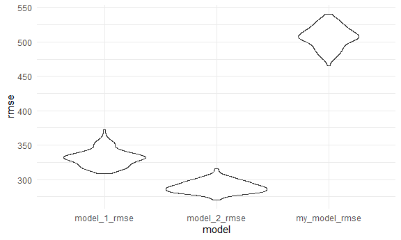

p8105\_hw6\_yl4604
================
Yu
December 8, 2020

Problem 1
---------

``` r
homicide_df = read_csv('data/homicide-data.csv', na = c('', 'NA', 'Unknown')) %>% 
  mutate(city_state = str_c(city, ',', state),
         resolved = case_when(
           disposition == 'Closed without arrest' ~ 0,
           disposition == 'Open/No arrest' ~ 0,
           disposition == 'Closed by arrest' ~ 1
         )) %>% 
  mutate(victim_age = as.numeric(victim_age)) %>% 
  filter(victim_race %in% c('White', 'Black')) %>% 
  filter(city_state != 'Tulsa,AL') %>% 
  select(city_state, resolved, victim_age, victim_race, victim_sex)
```

    ## Parsed with column specification:
    ## cols(
    ##   uid = col_character(),
    ##   reported_date = col_double(),
    ##   victim_last = col_character(),
    ##   victim_first = col_character(),
    ##   victim_race = col_character(),
    ##   victim_age = col_double(),
    ##   victim_sex = col_character(),
    ##   city = col_character(),
    ##   state = col_character(),
    ##   lat = col_double(),
    ##   lon = col_double(),
    ##   disposition = col_character()
    ## )

``` r
homicide_MD = homicide_df %>% 
  filter(city_state == 'Baltimore,MD')

logi_fit = glm(
  resolved ~ victim_age + victim_race + victim_sex, 
  data = homicide_MD,
  family = binomial()) %>% 
  broom::tidy() %>% 
  mutate(
    or = exp(estimate),
    ci_lwr = or - 1.96*std.error,
    ci_upr = or + 1.96*std.error) %>% 
  select(term, or,ci_lwr, ci_upr) %>% 
  knitr::kable(digit = 3)
```

``` r
homi_result = 
homicide_df %>%
  nest(data = -city_state) %>% 
  mutate(
    model = 
      map(.x = data, ~glm(resolved ~ victim_age+victim_race+victim_sex, data = .x, family = binomial())),
    results = map(model, broom::tidy)
  ) %>% 
  select(-data, -model) %>% 
  unnest(results) %>% 
  mutate(
    or = exp(estimate),
    ci_lwr = or - 1.96*std.error,
    ci_upr = or + 1.96*std.error) %>% 
  select(city_state, term, or,ci_lwr, ci_upr) 
```

Create a plot that shows the estimated ORs and CIs for each city. Organize cities according to estimated OR, and comment on the plot

``` r
homi_result %>% 
  filter(term == 'victim_raceWhite') %>% 
  mutate(city_state = fct_reorder(city_state, or)) %>% 
  ggplot(aes(x = city_state, y = or))+
  geom_point()+
  geom_errorbar(aes(ymin = ci_lwr, ymax = ci_upr)) +
  theme(axis.text.x = element_text(angle = 90, vjust = 0.5, hjust = 1))
```


Problem 2
---------

Load and clean the data for regression analysis (i.e. convert numeric to factor where appropriate, check for missing data, etc.).

``` r
birthwt_df = read_csv('data/birthweight.csv')%>% 
  mutate(frace = recode_factor(frace, `1` = 'White', `2` = 'Black', `3` = 'Asian', `4` = 'Puerto_Rican', `8` = 'Other', `9` = 'Unknown'),
         mrace = recode_factor(mrace, `1` = 'White', `2` = 'Black', `3` = 'Asian', `4` = 'Puerto_Rican', `8` = 'Other'),
         babysex = recode_factor(babysex, `1` = 'male', `2` =  'female'),
         malform = recode_factor(malform, `0` = 'absent', `1` = 'present')) 
```

    ## Parsed with column specification:
    ## cols(
    ##   .default = col_double()
    ## )

    ## See spec(...) for full column specifications.

``` r
birthwt_df %>% skimr::skim_without_charts()
```

|                                                  |            |
|:-------------------------------------------------|:-----------|
| Name                                             | Piped data |
| Number of rows                                   | 4342       |
| Number of columns                                | 20         |
| \_\_\_\_\_\_\_\_\_\_\_\_\_\_\_\_\_\_\_\_\_\_\_   |            |
| Column type frequency:                           |            |
| factor                                           | 4          |
| numeric                                          | 16         |
| \_\_\_\_\_\_\_\_\_\_\_\_\_\_\_\_\_\_\_\_\_\_\_\_ |            |
| Group variables                                  | None       |

**Variable type: factor**

| skim\_variable |  n\_missing|  complete\_rate| ordered |  n\_unique| top\_counts                             |
|:---------------|-----------:|---------------:|:--------|----------:|:----------------------------------------|
| babysex        |           0|               1| FALSE   |          2| mal: 2230, fem: 2112                    |
| frace          |           0|               1| FALSE   |          5| Whi: 2123, Bla: 1911, Pue: 248, Asi: 46 |
| malform        |           0|               1| FALSE   |          2| abs: 4327, pre: 15                      |
| mrace          |           0|               1| FALSE   |          4| Whi: 2147, Bla: 1909, Pue: 243, Asi: 43 |

**Variable type: numeric**

| skim\_variable |  n\_missing|  complete\_rate|     mean|      sd|      p0|      p25|      p50|      p75|    p100|
|:---------------|-----------:|---------------:|--------:|-------:|-------:|--------:|--------:|--------:|-------:|
| bhead          |           0|               1|    33.65|    1.62|   21.00|    33.00|    34.00|    35.00|    41.0|
| blength        |           0|               1|    49.75|    2.72|   20.00|    48.00|    50.00|    51.00|    63.0|
| bwt            |           0|               1|  3114.40|  512.15|  595.00|  2807.00|  3132.50|  3459.00|  4791.0|
| delwt          |           0|               1|   145.57|   22.21|   86.00|   131.00|   143.00|   157.00|   334.0|
| fincome        |           0|               1|    44.11|   25.98|    0.00|    25.00|    35.00|    65.00|    96.0|
| gaweeks        |           0|               1|    39.43|    3.15|   17.70|    38.30|    39.90|    41.10|    51.3|
| menarche       |           0|               1|    12.51|    1.48|    0.00|    12.00|    12.00|    13.00|    19.0|
| mheight        |           0|               1|    63.49|    2.66|   48.00|    62.00|    63.00|    65.00|    77.0|
| momage         |           0|               1|    20.30|    3.88|   12.00|    18.00|    20.00|    22.00|    44.0|
| parity         |           0|               1|     0.00|    0.10|    0.00|     0.00|     0.00|     0.00|     6.0|
| pnumlbw        |           0|               1|     0.00|    0.00|    0.00|     0.00|     0.00|     0.00|     0.0|
| pnumsga        |           0|               1|     0.00|    0.00|    0.00|     0.00|     0.00|     0.00|     0.0|
| ppbmi          |           0|               1|    21.57|    3.18|   13.07|    19.53|    21.03|    22.91|    46.1|
| ppwt           |           0|               1|   123.49|   20.16|   70.00|   110.00|   120.00|   134.00|   287.0|
| smoken         |           0|               1|     4.15|    7.41|    0.00|     0.00|     0.00|     5.00|    60.0|
| wtgain         |           0|               1|    22.08|   10.94|  -46.00|    15.00|    22.00|    28.00|    89.0|

### propose a model

There is sense that mother's pre-birth BMI will have a positive impact on babybirthweight, and a mother who is smoking would have negtive impact on babybirth weight.

``` r
birthwt_df %>% 
  ggplot(aes(x = ppbmi, y = bwt)) +geom_point()
```


``` r
birthwt_df %>% 
  mutate(smoken = case_when(
    smoken == 0 ~ '0',
    smoken > 0&smoken <=5 ~ 'less than 5',
    smoken <= 10&smoken >5 ~ 'less than 10',
    TRUE ~ 'more than 10'
     )) %>% 
  ggplot(aes(x = smoken, y = bwt)) + geom_violin()
```


The above plots sort of align with the hypothesis that PPBMI and smoken are factors underly babybirth weight.

So the model I propose is:

``` r
my_model = lm(bwt ~ ppbmi + smoken, data = birthwt_df)

birthwt_df %>% 
  modelr::add_residuals(my_model) %>% 
  modelr::add_predictions(my_model) %>% 
  ggplot(aes(x = pred, y = resid)) +
  geom_point()
```


### setted model

``` r
model_1 = lm(bwt ~ blength + gaweeks, data = birthwt_df)
summary(model_1)
```

    ## 
    ## Call:
    ## lm(formula = bwt ~ blength + gaweeks, data = birthwt_df)
    ## 
    ## Residuals:
    ##     Min      1Q  Median      3Q     Max 
    ## -1709.6  -215.4   -11.4   208.2  4188.8 
    ## 
    ## Coefficients:
    ##              Estimate Std. Error t value Pr(>|t|)    
    ## (Intercept) -4347.667     97.958  -44.38   <2e-16 ***
    ## blength       128.556      1.990   64.60   <2e-16 ***
    ## gaweeks        27.047      1.718   15.74   <2e-16 ***
    ## ---
    ## Signif. codes:  0 '***' 0.001 '**' 0.01 '*' 0.05 '.' 0.1 ' ' 1
    ## 
    ## Residual standard error: 333.2 on 4339 degrees of freedom
    ## Multiple R-squared:  0.5769, Adjusted R-squared:  0.5767 
    ## F-statistic:  2958 on 2 and 4339 DF,  p-value: < 2.2e-16

``` r
model_2 = lm(bwt~ bhead*blength*babysex, data = birthwt_df)
summary(model_2)
```

    ## 
    ## Call:
    ## lm(formula = bwt ~ bhead * blength * babysex, data = birthwt_df)
    ## 
    ## Residuals:
    ##      Min       1Q   Median       3Q      Max 
    ## -1132.99  -190.42   -10.33   178.63  2617.96 
    ## 
    ## Coefficients:
    ##                               Estimate Std. Error t value Pr(>|t|)    
    ## (Intercept)                 -7176.8170  1264.8397  -5.674 1.49e-08 ***
    ## bhead                         181.7956    38.0542   4.777 1.84e-06 ***
    ## blength                       102.1269    26.2118   3.896 9.92e-05 ***
    ## babysexfemale                6374.8684  1677.7669   3.800 0.000147 ***
    ## bhead:blength                  -0.5536     0.7802  -0.710 0.478012    
    ## bhead:babysexfemale          -198.3932    51.0917  -3.883 0.000105 ***
    ## blength:babysexfemale        -123.7729    35.1185  -3.524 0.000429 ***
    ## bhead:blength:babysexfemale     3.8781     1.0566   3.670 0.000245 ***
    ## ---
    ## Signif. codes:  0 '***' 0.001 '**' 0.01 '*' 0.05 '.' 0.1 ' ' 1
    ## 
    ## Residual standard error: 287.7 on 4334 degrees of freedom
    ## Multiple R-squared:  0.6849, Adjusted R-squared:  0.6844 
    ## F-statistic:  1346 on 7 and 4334 DF,  p-value: < 2.2e-16

make comparison:

``` r
cv_df = 
  crossv_mc(birthwt_df, 100) %>% 
  mutate(
    train = map(train, as.tibble),
    test = map(test, as.tibble)) %>% 
  mutate(
    my_model = map(.x = train, ~lm(bwt ~ ppbmi + smoken, data = .x )),
    model_1 = map(.x = train,~lm(bwt ~ blength + gaweeks, data = .x)),
    model_2 = map(.x = train,~lm(bwt~ bhead*blength*babysex, data = .x)),
  ) %>% 
  mutate(
    my_model_rmse = map2_dbl(my_model, test, ~rmse(model = .x, data = .y)),
    model_1_rmse = map2_dbl(model_1, test, ~rmse(model = .x, data = .y)),
    model_2_rmse = map2_dbl(model_2, test, ~rmse(model = .x, data = .y))
  ) %>% 
  select(ends_with('rmse')) %>% 
  pivot_longer(
    everything(),
    names_to = 'model',
    values_to = 'rmse'
  ) %>% 
    ggplot(aes(x = model, y = rmse)) + geom_violin()
```

    ## Warning: Problem with `mutate()` input `train`.
    ## i `as.tibble()` is deprecated as of tibble 2.0.0.
    ## Please use `as_tibble()` instead.
    ## The signature and semantics have changed, see `?as_tibble`.
    ## This warning is displayed once every 8 hours.
    ## Call `lifecycle::last_warnings()` to see where this warning was generated.
    ## i Input `train` is `map(train, as.tibble)`.

    ## Warning: `as.tibble()` is deprecated as of tibble 2.0.0.
    ## Please use `as_tibble()` instead.
    ## The signature and semantics have changed, see `?as_tibble`.
    ## This warning is displayed once every 8 hours.
    ## Call `lifecycle::last_warnings()` to see where this warning was generated.

``` r
cv_df
```



According to the plot, the second model, which is model\_2(using head circumference, length, sex, and all interactions (including the three-way interaction) between these) has the best fitness.

Problem 3
---------

For this problem, we’ll use the 2017 Central Park weather data that we’ve seen elsewhere. The code chunk below (adapted from the course website) will download these data.

``` r
weather_df = 
  rnoaa::meteo_pull_monitors(
    c("USW00094728"),
    var = c("PRCP", "TMIN", "TMAX"), 
    date_min = "2017-01-01",
    date_max = "2017-12-31") %>%
  mutate(
    name = recode(id, USW00094728 = "CentralPark_NY"),
    tmin = tmin / 10,
    tmax = tmax / 10) %>%
  select(name, id, everything())
```

    ## Registered S3 method overwritten by 'hoardr':
    ##   method           from
    ##   print.cache_info httr

    ## using cached file: C:\Users\YULIU\AppData\Local\Cache/R/noaa_ghcnd/USW00094728.dly

    ## date created (size, mb): 2020-10-01 11:31:33 (7.534)

    ## file min/max dates: 1869-01-01 / 2020-09-30

``` r
boot_straps = 
  weather_df %>% 
  modelr::bootstrap(n = 5000) %>% 
  mutate(
    model = map(strap, ~lm(tmax~tmin, data = .x)),
    glance = map(model, broom::glance),
    results = map(model, broom::tidy)
  ) %>% 
  unnest(glance) %>% 
  select(.id, r.squared, results) %>% 
  unnest(results) %>%
  mutate(
    term=str_replace(term,"\\(Intercept\\)","Intercept")
  ) %>% 
  pivot_wider(
    names_from = term,
    values_from = estimate
  ) %>% 
 group_by(.id) %>% 
  summarise(intercept = max(Intercept, na.rm = TRUE),
            tmin = max(tmin, na.rm = TRUE),
            r.squared = mean(r.squared)) %>% 
  mutate(
    result = log(intercept*tmin)
  )
```

    ## `summarise()` ungrouping output (override with `.groups` argument)

``` r
boot_straps %>% 
  ggplot(aes(x = r.squared)) + geom_density()+
  labs(title = 'distribution of r_squared')
```


``` r
boot_straps %>% 
  ggplot(aes(x = r.squared)) + geom_density()+
  labs(title = 'distribution of log(beta0*beta1)')
```


Both r\_squared and log(beta0\*beta1) follows normal distribution, which align with central limit theorem.

``` r
boot_straps %>% 
  summarize(
    r_squared_ci_lower = quantile(r.squared, 0.025), 
    r_squared_ci_upper = quantile(r.squared, 0.975),
    result_ci_lower = quantile(result, 0.025), 
    result_ci_upper = quantile(result, 0.975))
```

    ## # A tibble: 1 x 4
    ##   r_squared_ci_lower r_squared_ci_upper result_ci_lower result_ci_upper
    ##                <dbl>              <dbl>           <dbl>           <dbl>
    ## 1              0.894              0.927            1.97            2.06

r<sup>2\ log(β</sup>0∗β^1) Use 5000 bootstrap samples and, for each bootstrap sample, produce estimates of these two quantities. Plot the distribution of your estimates, and describe these in words. Using the 5000 bootstrap estimates, identify the 2.5% and 97.5% quantiles to provide a 95% confidence interval for r^2 and log(β<sup>0∗β</sup>1). Note: broom::glance() is helpful for extracting r^2 from a fitted regression, and broom::tidy() (with some additional wrangling) should help in computing log(β<sup>0∗β</sup>1)
